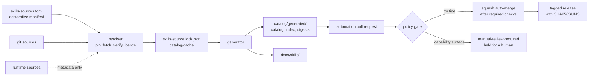

<div align="center">

# Claude Code Toolkit

**A reproducible, verifiable Claude Code setup — skills, agents, hooks and provider switching, installed with one command.**

[](https://github.com/furkankoykiran/.claude/actions/workflows/ci.yml "Continuous integration status")
[](https://github.com/furkankoykiran/.claude/releases/latest "Latest published release")
[](LICENSE "This repository's own code is MIT licensed")
[](docs/getting-started.md "Supported platforms")

[Getting started](docs/getting-started.md) · [Configuration](docs/configuration.md) · [Security](docs/security-model.md) · [Catalog](docs/catalog-architecture.md) · [FAQ](docs/faq.md)

</div>

---

## What this is

Claude Code is far more capable once it has skills, agents and hooks wired in —
but assembling those from a dozen upstream repositories, keeping them current,
and knowing what you actually installed is tedious and easy to get wrong.

This toolkit does that assembly and keeps it honest:

- **One command installs it**, on Linux, macOS, native Windows or WSL.
- **Every skill is cataloged** with its source, revision, licence and content
  digest — so you can see exactly what is on your machine and where it came from.
- **Upstream updates arrive as reviewed pull requests**, not silent overwrites.
  Routine changes merge automatically; anything carrying capability surface
  (hooks, agents, executables, credentials, network access) is held for a human.
- **Releases are reproducible and checksummed.**

> **Not an official Anthropic project.** It packages Anthropic's published
> skills alongside third-party and repository-owned ones, each under its own
> licence.

## Quick start

**Linux · macOS · WSL · Git Bash**

```bash
curl -fsSL https://raw.githubusercontent.com/furkankoykiran/.claude/main/install.sh | bash
```

**Windows (native PowerShell)**

```powershell
irm https://raw.githubusercontent.com/furkankoykiran/.claude/main/install.ps1 | iex
```

Native Windows requires [Git for Windows](https://git-scm.com/download/win) — it
bundles Git Bash, which runs the shell hooks.

Re-running is safe. The installer is idempotent and fail-soft: it never
overwrites an existing `config.json` or `settings.json`, and a component that
fails to install does not abort the rest.

**Required:** `git`, `curl`, `bash` (or PowerShell 7+ on Windows).
**Bootstrapped if missing:** `bun`, `rtk`, `gstack`, Chromium for browser
skills. Optional components can be skipped — see
[installer flags](docs/getting-started.md).

Verify the install:

```bash
bun install --frozen-lockfile && bun run catalog:check
```

Update with `cd ~/.claude && git pull && ./install.sh`. Uninstall instructions
are in [Getting started](docs/getting-started.md).

## What you get

| Component | Location | What it does |
| --- | --- | --- |
| **Skills** | `skills/` | Markdown capabilities Claude invokes as `/name` |
| **Agents** | `agents/` | Focused sub-agents (`researcher`, `code-reviewer`, `debugger`, `planner`) |
| **Hooks** | `hooks/` | Format on edit, secret scan on commit, pre-push verify, Docker volume protection |
| **Providers** | `providers/`, `bin/cc-provider` | Switch Claude Code between Anthropic, NVIDIA, DeepSeek, Kimi, MiniMax, OpenRouter, Z.ai |
| **Utilities** | `utils/` | Shared Python helpers and profile-aware config |
| **Catalog** | `catalog/` | Deterministic resolver + generator producing the verifiable skills catalog |

## How it fits together



## The catalog

Every skill is resolved from a declared source, pinned to an immutable revision,
licence-checked, and recorded with a content digest. Generation is
deterministic — two runs produce byte-identical output — so the committed
catalog is verifiable rather than trusted.

How sources are selected:

| Mode | Meaning | New upstream skills |
| --- | --- | --- |
| `all-skills` | every `<dir>/SKILL.md` under a root | ingested automatically |
| `named` | only the listed skills | **never** — reported, not added |
| `subpath` | one skill at a fixed path | **never** — siblings reported |
| `repo-owned` | committed in this repository | n/a |
| `runtime` | resolved by the `claude` CLI, PyPI or an installer | metadata only |

**metadata-only** sources publish name, description, digest and an immutable
link but never the body — either upstream grants no redistribution right, or the
component cannot be resolved from files.

```bash
bun run catalog:coverage   # what each source contributes, and what is curated out
```

See [Catalog coverage](docs/catalog-coverage.md) and
[Catalog architecture](docs/catalog-architecture.md).

## Safety model

Skills are instructions Claude reads; they are not sandboxed. Adding a source is
a supply-chain decision, so the automation treats it as one.

A change is held for human review when it introduces a credential reference,
executable or binary, hooks, MCP/LSP config, agents, dynamic shell, Bash or
PowerShell, network access or hidden files — or when an existing skill *gains*
any of those, the tool surface grows, redistribution or licence changes, the
source repository changes, a skill is removed or renamed, or the batch is
unusually large.

Detection does not rely on the content digest: the same bytes re-pointed at a
different repository or re-licensed is still a change. Auto-merge state is torn
down and re-proven on every run, so a merge request enabled by an earlier
routine update cannot carry into a later sensitive one.

API keys live only in git-ignored files; a commit hook scans staged content.
Full detail in [Security model](docs/security-model.md).

## Repository layout

<!-- root-layout:start -->
```text
agents/          sub-agent definitions
bin/             executables on PATH (cc-provider)
catalog/         catalog toolchain (src, tests, cache, generated)
docs/            documentation — start at docs/README.md
hooks/           git and Claude Code hooks
memory/          persistent memory files
providers/       API provider definitions
scripts/         maintenance and test scripts
skills/          skills (repository-owned and vendored packs)
utils/           shared Python helpers
install.sh       installer for Linux/macOS/WSL — public URL, do not move
install.ps1      installer for native Windows — public URL, do not move
skills-sources.toml       declarative source manifest
skills-source.lock.json   pinned revisions and digests
package.json     catalog toolchain scripts
tsconfig.json    TypeScript configuration
bun.lock         dependency lock
CLAUDE.md        repository instructions for Claude Code
README.md        this file
CHANGELOG.md     notable changes
CONTRIBUTING.md  contribution guide
CODE_OF_CONDUCT.md  community standards
SECURITY.md      vulnerability reporting
LICENSE          MIT, for this repository's own code
config.json.example     template seeded to config.json on install
settings.json.example   template seeded to settings.json on install
PSScriptAnalyzerSettings.psd1   PowerShell lint configuration
```
<!-- root-layout:end -->

Generated artifacts live in `catalog/generated/` and are rebuilt by
`bun run catalog:generate` — never edit them by hand. Published release **asset
names** stay stable regardless of where their sources sit in the tree.

## Contributing

Contributions are genuinely welcome — this is more useful the more people shape
it. Especially valuable:

- **New source adapters** and skill sources, with a clear upstream licence
- **Platform support** — macOS, native Windows and WSL edge cases
- **Tests**, particularly around the resolver and the policy gate
- **Documentation** — if something here was unclear, that is a bug
- **Bug reports** including the failing command's output

Before opening a pull request:

```bash
bun install --frozen-lockfile
bun run typecheck
bun test catalog
bun run catalog:check
bun run docs:check
```

See [CONTRIBUTING.md](CONTRIBUTING.md) and the
[Code of Conduct](CODE_OF_CONDUCT.md).

## Security

Report vulnerabilities privately — see [SECURITY.md](SECURITY.md). Please do not
open a public issue for security reports.

## Licence and acknowledgements

This repository's own code is [MIT](LICENSE). Cataloged and vendored content
keeps its upstream licence; the resolver verifies each and withholds bodies it
may not republish.

Built on the work of [gstack](https://github.com/garrytan/gstack),
[Anthropic's skills](https://github.com/anthropics/skills),
[impeccable](https://github.com/pbakaus/impeccable),
[marketing skills](https://github.com/coreyhaines31/marketingskills),
[taste-skill](https://github.com/Leonxlnx/taste-skill),
[manim skills](https://github.com/adithya-s-k/manim_skill),
[Karpathy guidelines](https://github.com/multica-ai/andrej-karpathy-skills) and
[rtk](https://github.com/rtk-ai/rtk). Thank you to their authors.