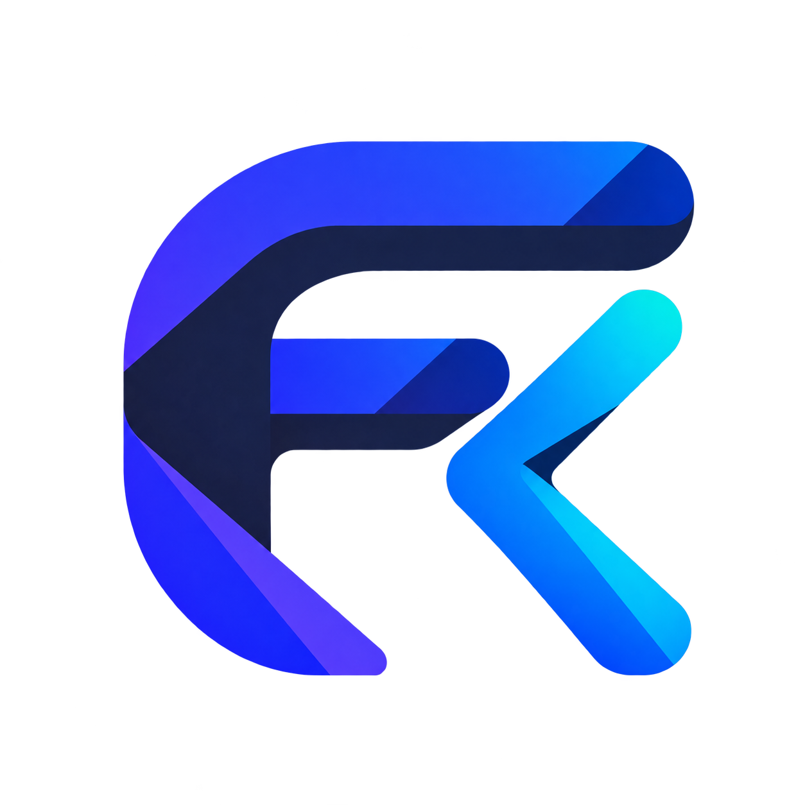
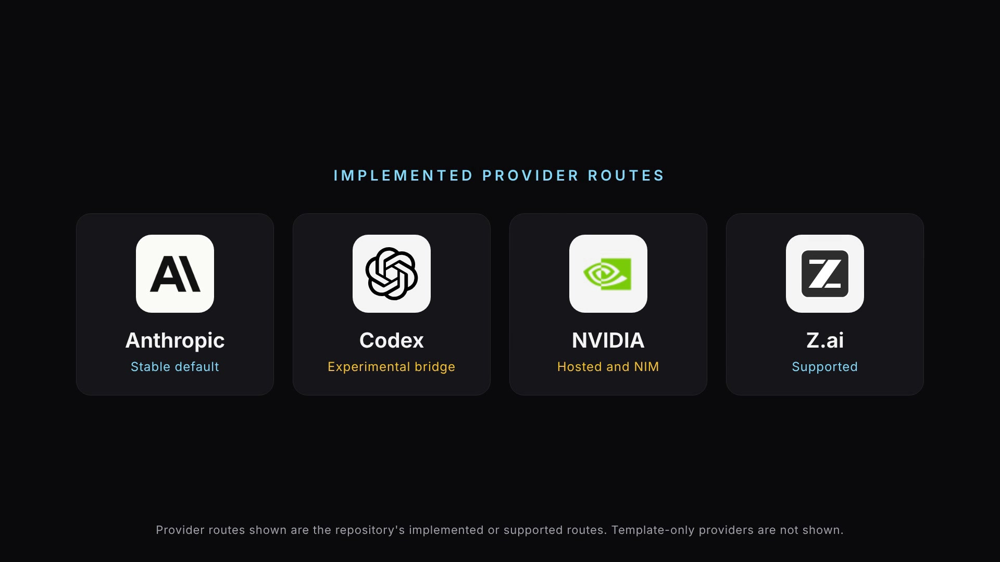
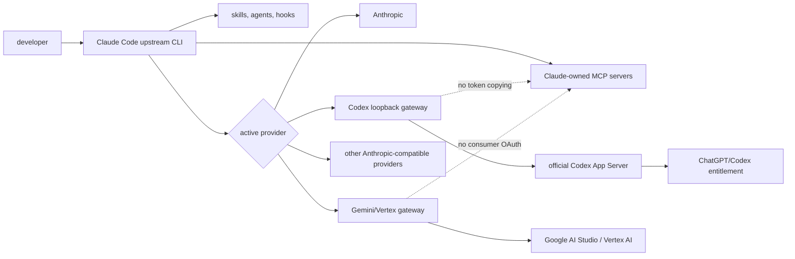
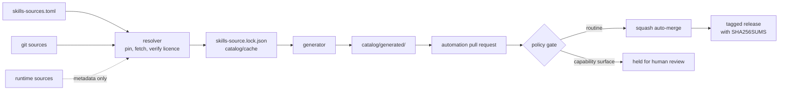

<div align="center">



# Claude Code Toolkit

**A reproducible, verifiable Claude Code setup — skills, agents, hooks and provider switching, installed with one command.**

[Getting started](docs/getting-started.md) · [Configuration](docs/configuration.md) · [Providers](docs/provider-capability-matrix.md) · [Security](docs/security-model.md) · [Troubleshooting](docs/troubleshooting.md)

</div>

---

## What this is

Claude Code is the upstream harness. This toolkit keeps it that way, then layers on top:
curated skills, agents, hooks, MCP starters, provider switching, and the checks that tell
you what is actually active.

- **Install only what you want.** Four plugins via the Claude Code marketplace, or the
  full bootstrap in one command on Linux, macOS, native Windows or WSL.
- **Context cost is measured.** The skill listing is CI-enforced at 2,048 chars — half
  of what a 200k-token context allows. Without that cap, Claude silently drops skills
  past its 2% budget.
- **Every skill is pinned** to a reviewed commit SHA, licence-checked, and recorded with
  a content digest.
- **Updates never destroy your work.** Fast-forward only; a conflicting update refuses
  and tells you rather than resolving silently.
- **Upstream updates arrive as reviewed PRs.** Routine changes auto-merge; anything with
  capability surface (hooks, agents, credentials, network access) waits for a human.
- **Provider switching without pretending.** Codex uses the official CLI/App Server path;
  tokens stay with their native owner. Gemini/Vertex via AI Studio key or Vertex
  credentials. Personal Antigravity consumer OAuth is never proxied into Claude Code.
- **No telemetry, no account, no service.**

<div align="center">

<video src="docs/media/launch.mp4" controls="controls" muted="muted" width="100%" poster="docs/media/launch-poster.jpg">
  <a href="docs/media/launch.mp4">
    
  </a>
</video>

</div>

## Quick start

### Just the plugins

```
/plugin marketplace add furkankoykiran/.claude
/plugin install fk-gh-flow@fk-toolkit
```

| Plugin | What it does | Listing cost |
| --- | --- | --- |
| `fk-gh-flow` | Find issues, solve into PRs, follow up on review, write human-sounding comments | 746 chars |
| `fk-writing-kit` | Strip AI tells from drafts; build posts from a chat, URL or GitHub profile | 819 chars |
| `fk-eng-agents` | researcher · planner · code-reviewer · debugger subagents | **0** |
| `fk-toolkit-ops` | Manage updates, MCP setup, Codex-native ImageGen boundaries | 233 chars |

Plugins carry no hooks and no executables.

### The whole toolkit

**Linux · macOS · WSL · Git Bash**

```bash
curl -fsSL https://raw.githubusercontent.com/furkankoykiran/.claude/main/install.sh | bash
```

**Windows (native PowerShell)**

```powershell
irm https://raw.githubusercontent.com/furkankoykiran/.claude/main/install.ps1 | iex
```

Re-running is safe. Verify the install:

```bash
bun install --frozen-lockfile
bun run catalog:check
fkt doctor
```

### Provider quickstart

Switch provider and verify:

```bash
# Anthropic (default)
ccs anthropic

# Codex (experimental — live inference pending; see provider matrix)
fkt setup --yes --provider codex --model gpt-5.5 --effort medium
ccs login codex
ccs codex
ccs status

# Google Gemini (requires GEMINI_API_KEY or Vertex credentials)
ccs google
```

See [Provider capability matrix](docs/provider-capability-matrix.md) for tested boundaries.
Codex and Gemini are **experimental / live-test-pending** — see [Status and limitations](#status-and-limitations).

### Updating

```bash
fkt check    # is there an update?
fkt update   # fast-forward, then run migrations
```

## Architecture


```mermaid
flowchart LR
  U["developer"] --> CC["Claude Code upstream CLI"]
  CC --> S["skills, agents, hooks"]
  CC --> MCP["Claude-owned MCP servers"]
  P{"active provider"} --> A["Anthropic"]
  P --> C["Codex loopback gateway"]
  P --> G["Gemini/Vertex gateway"]
  P --> O["other Anthropic-compatible providers"]
  CC --> P
  C --> APP["official Codex App Server"]
  APP --> CHATGPT["ChatGPT/Codex entitlement"]
  G --> GEMINI["Google AI Studio / Vertex AI"]
  C -. "no token copying" .-> MCP
  G -. "no consumer OAuth" .-> MCP
```

Claude Code remains the executable you run. The toolkit changes configuration, not the
harness. Provider gateways are pinned submodules at `gateways/`.

### Catalog pipeline


```mermaid
flowchart LR
  M["skills-sources.toml"] --> RES
  G["git sources"] --> RES["resolver<br/>pin, fetch, verify licence"]
  R["runtime sources"] -. metadata only .-> RES
  RES --> L["skills-source.lock.json<br/>catalog/cache"]
  L --> GEN["generator"]
  GEN --> OUT["catalog/generated/"]
  OUT --> PR["automation pull request"]
  PR --> GATE{"policy gate"}
  GATE -- routine --> AM["squash auto-merge"]
  GATE -- capability surface --> HUMAN["held for human review"]
  AM --> REL["tagged release<br/>with SHA256SUMS"]
```

Every skill is pinned to a reviewed SHA, licence-checked, and recorded with a content
digest. Two consecutive `bun run catalog:generate` runs produce byte-identical output.

## Status and limitations

| Provider | Status | Notes |
| --- | --- | --- |
| Anthropic | **Stable default** | Full Claude Code feature parity |
| Codex | **Experimental** | Live text inference pending — current custom-endpoint probes did not forward the actionable prompt; gateway fails closed |
| Google / Gemini | **Experimental** | Requires official AI Studio key or Vertex credentials; no consumer OAuth |
| NVIDIA, Z.ai, DeepSeek, Kimi, MiniMax, OpenRouter | Template | Provider-dependent; not live-tested in this repository |

## Repository layout

<!-- root-layout:start -->
```text
.claude-plugin/  generated marketplace manifest
AGENTS.md        shared cross-agent repository instructions
bin/             executables on PATH (cc-provider, fkt)
bun.lock         dependency lock
catalog/         catalog toolchain (src, tests, cache, generated)
CLAUDE.md        repository instructions for Claude Code
CODE_OF_CONDUCT.md  community standards
config.json.example     template seeded to config.json on install
CONTRIBUTING.md  contribution guide
docs/            documentation — start at docs/README.md
gateways/        pinned runtime submodules (Codex and Gemini gateways)
hooks/           git and Claude Code hooks
install.ps1      installer for native Windows — public URL, do not move
install.sh       installer for Linux/macOS/WSL — public URL, do not move
LICENSE          MIT, for this repository's own code
marketplace.toml          plugin marketplace source of truth
mcp-registry.toml         curated portable MCP registry
memory/          persistent memory files
migrations/      versioned bootstrap migrations run by `fkt`
package.json     catalog toolchain scripts
providers/       API provider definitions
PSScriptAnalyzerSettings.psd1   PowerShell lint configuration
README.md        this file
scripts/         maintenance and test scripts
security-advisories.tsv   advisory feed consumed by `fkt`
SECURITY.md      vulnerability reporting
settings.base.json      repo-owned safety config merged on every provider switch
settings.json.example   optional settings, merged with settings.base.json on install
skills/          repo-owned plugins (fk-*) and installer-fetched packs
skills-source.lock.json   pinned revisions and digests
skills-sources.toml       declarative source manifest
tsconfig.json    TypeScript configuration
utils/           shared Python helpers
VERSION          single version source of truth
```
<!-- root-layout:end -->

## Contributing

Before opening a pull request:

```bash
bun install --frozen-lockfile
bun run typecheck
bun test catalog
bun run catalog:check
bun run docs:check
```

See [CONTRIBUTING.md](CONTRIBUTING.md) and the [Code of Conduct](CODE_OF_CONDUCT.md).
Report vulnerabilities privately — see [SECURITY.md](SECURITY.md).

## Licence and acknowledgements

This repository's own code is [MIT](LICENSE). Cataloged content keeps its upstream licence.

Built on: [gstack](https://github.com/garrytan/gstack) · [Anthropic's skills](https://github.com/anthropics/skills) · [impeccable](https://github.com/pbakaus/impeccable) · [marketing skills](https://github.com/coreyhaines31/marketingskills) · [taste-skill](https://github.com/Leonxlnx/taste-skill) · [Karpathy guidelines](https://github.com/multica-ai/andrej-karpathy-skills) · [rtk](https://github.com/rtk-ai/rtk)